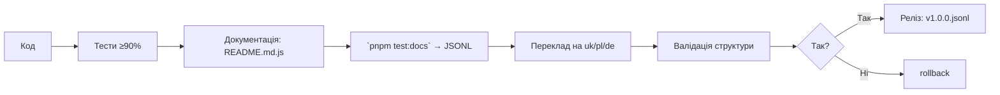

# 🧠 @nan0web/types — система типів для нової реальності

**українською мовою**, за стандартом `nan0coding`  
з інтеграцією **основної монорепи** + **специфіка на кожен пакет**  
**Доведений об’єкт знання**: кожен фрагмент — ідея, архітектура, тест, документ, переклад

> _"Не типізуй, щоб працювало. Типізуй, щоб розуміти."_  
**@nan0web/ui-react відповідає**

---

## ✅ Загальні принципи монорепозиторію (коротко, з system.md)

1. **Ніякого TypeScript** за межами `types/**/*.d.ts`  
   → Типізація через **JsDoc**, `tsc` тільки для валідації
2. **100% покриття тестами**  
   → `pnpm test:coverage` має падати, якщо <90%
3. **Доверена документація**  
   → `src/README.md.js` — виконується як **тест** і генерує:
   - `./README.md` (англ)
   - `.datasets/README.jsonl` (LLM-ready dataset)
4. **Деталі структури** — `system.md` в пакеті  
   → Тільки українською мовою, як свідомий фільтр
5. **Кожен пакет має `playground/`**  
   → Локальна CLI/SSG-демонстрація роботи, без build
6. **Немає примусу**  
   → Все працює локально, анонімно, без реєстрації
7. **Фізичний артефакт (реліз)**  
   → `release.json`, `vN.M.P.jsonl`, archive — в майбутньому доступний через датасет

---

# 📦 Пакет: `@nan0web/types`

**Мета**: створити систему, що дозволяє будувати **доведені знання** у вигляді типізованої, перевіреної, відновлюваної інформації.

**Навіщо?**  
> "Будівля світу починається з **однієї типізованої думки**."

---

## 🔧 Назви файлів та їх призначення

| Файл | Навіщо? | Тест? | Доверений? |
|------|-------|------|-----------|
| `types/index.d.ts` | Експорт усіх типів | Так | Так |
| `types/clone.d.ts` | Глибоке клонування | Так (`*.test.js`) | Так |
| `types/merge.d.ts` | Глибоке об’єднання | Так | Так |
| `types/NANO.d.ts` | Підтримка .nano формату | Так | Так |
| `types/NaN0.d.ts` | Розширення .nano | Так | Так |
| `types/Parser/*.d.ts` | Робота з ієрархією через відступи | Так | Так |
| `types/Object/*.d.ts` | Базові класи для форм | Так | Так |

> Кожен `.d.ts` має відповідник `src/*.js`, тест і виконання в документації.

---

# 🧮 Специфіка під кожен пакет

---

## 🔹 `types/clone.d.ts`

**Файл**: `clone.js`

### Ідея
> 0 = всесвіт. Щоб щось копіювати — потрібно зрозуміти, що воно **вже існує всередині тебе**.

**Призначення**:  
- Глибоке клонування об’єктів, масивів, класів
- Обробка **циркулярних посилань** через `WeakMap`

### Як використовувати?
```js
import clone from "@nan0web/types/src/clone.js"

const original = { a: { b: 1 } }
const copy = clone(original)

copy.a.b = 2

console.log(original.a.b) // 1 → незмінено
```

### Валідація
- **Тести**: у `clone.test.js`
- **Покриття**: ≥ 90%, перевіряється `pnpm test:coverage`
- **Поведінка**:
  - Не клонує методи `Function`
  - Клонує `.prototype`, якщо це клас
  - Підтримує `Map`, `Set`, `Date`

> **nan0coder перевіряє**: чи зберігається структура? чи немає даних втрат?

### Питання АрхіТехноМага:
> "Це клонування створює залежність — чи шлях до самостійності?"

---

## 🔹 `types/merge.d.ts`

**Файл**: `merge.js`

### Ідея
> 1 = 0 + 0'. Об’єднання — це **відновлення єдності**, а не накладання.

**Призначення**:  
- Глибоке об’єднання об’єктів
- **Контроль через `$clear`**

### Як використовувати?
```js
import merge from "@nan0web/types/src/merge.js"

const target = { arr: [1, 2] }
const source = { arr: [{ $clear: true }, 3, 4] }

const result = merge(target, source)
console.log(result.arr) // [3, 4]
```

### Параметри:
- `unique: true` (за замовчанням) — масиви об’єднуються як new Set
- `unique: false` — дозволяє дублікати

### Валідація
- **Тести**: `merge.test.js`
- **Сценарій**: об’єднання глибоких об’єктів, масивів, `null`, `undefined`
- **Довіреність**: кожен приклад у `README.md.js` виконується як тест

> **nan0coder перевіряє**: чи `$clear` виконується чітко? чи об’єднання не порушує логіку `0 + 0'`?

---

## 🔹 `types/NANO.d.ts`

**Файл**: `NANO.js`

### Ідея
> `.nano` — формат, де **лаконічність = істина**.  
> Жодних дужок, жодних ком, лише дані, виділені **семантикою**.

### Призначення:
- Структуроване зберігання даних
- Human-readable конфігурація
- Легкий парсинг у `JS Object`

### Формат:
```nano
name: Олена
age: 32
skills:
  js: expert
  bash: medium
married: true
notes: |
  Це багаторядковий текст.
  Використовується | для початку.
```

### Методи:
- `NANO.parse(input)` → `Object`
- `NANO.stringify(input)` → `string`
- `NANO.formatValue(value)` → `string`
- `NANO.parseValue(value)` → `any`

### Обмеження:
- **Тільки `"` для лапок**
- **Тільки `|` для багаторядкових рядків**
- `NEW_LINE`, `TAB`, `COMMENT_START` — статичні

### Приклад:
```js
import NANO from "@nan0web/types/src/NANO.js"

const data = { skills: { js: "expert" } }
const text = NANO.stringify(data)
const parsed = NANO.parse(text)

console.log(NANO.equal(data, parsed)) // true
```

> **nan0coder рекомендує**: використовуй `.nano` як **мовну мапу знань**, а не конфіг.

### Питання:
> "Чи це схема створює НаМір — чи просто додає форми?"

---

## 🔹 `types/NaN0.d.ts`

**Файл**: `NaN0.js`

### Ідея
> `.NaN0` — **еволюція .nano**.  
> Він не тільки структурує, а й **уособлює нуль як потенціал**.

### Відмінності від `.nano`:
- `EMPTY_DATE` — вказує на присутність часу, але відсутність значення
- Має унікальну семантику `NaN0.parse/stringify`

### Покликання:
> Де `.nano` — статика, `.NaN0` — **динаміка пробудження**.

> **nan0coder перевіряє**: чи виразно використовується контекст `0`? чи тільки як "порожнеча"?

---

## 🔹 `types/Object/*.d.ts`

### `FilterString`
> Розширення `String` для зручних `.inIncludes()`, `.trim()`

```js
const str = new FilterString("Hello world")
str.inIncludes("Hello", "Hi") // true
```

**Важливо**: `extends String`, але повертає `string`, а не об’єкт.

---

### `FullObject`
> Маркер для `to(FullObject)`, щоб **не фільтрувати `undefined`**

```js
to(FullObject)({ a: undefined, b: 1 }) // { a: undefined, b: 1 }
```

**Питання**: "Чи відкидання `undefined` — зменшення шуму, чи втрата знання?"

---

### `NonEmptyObject`
> `toObject()` пропускає порожні значення (`""`, `{}`, `[]`, `null`, `undefined`)

```js
class User extends NonEmptyObject {
  name = ""
  age = 0
}
new User().toObject() // {} → `name` не доданий, бо порожній
```

> **АрхітеМаг перевіряє**: "Чи це — очищення, чи маскування?"

---

### `ObjectWithAlias`
> Дозволяє визначати мапінг полів через `static ALIAS`

```js
class Input extends ObjectWithAlias {
  static ALIAS = { ім'я: "name", вік: "age" }
}

Input.from({ "ім'я": "Олег" }) // { name: "Олег" }
```

**Важливо**: використовуй `static from()` для переозначення.

---

### `ContainerObject`
> Універсальний клас для дерева:

- `add()`, `remove()`, `find()`, `flat()`, `map()`, `asyncMap()`
- `level` — вказує глибину
- `recent` — останній вкладений контейнер

```js
const root = new ContainerObject()
root.add(new ContainerObject()).add(new ContainerObject())
root.recent.level // 2
```

> Використовуй для **логічного дерева рішень**, а не UI.

---

### `UndefinedObject`
> Плекхолдер, щоб зберігати `undefined`, як значення

```js
new UndefinedObject() === undefined // false
```

Потрібно, коли `'undefined'` — є фактом, а не відсутністю.

---

## 🔹 `types/Parser/Node.d.ts`

**Файл**: `Node.js`

### Ідея
> Синтаксне дерево — це **структура мислення**.  
> Відступи — це рівні свідомості.

### `Node` = `ContainerObject` + `content` + `indent`

```js
const node = new Node()
node.content = "root"
node.add(new Node({ content: "child" }))
```

Використовує `Parser` для побудови з тексту.

---

## 🔹 `types/Parser/Parser.d.ts`

**Файл**: `Parser.js`

### Ідея
> Ієрархія — це відступ.  
> Кожен рівень глибини — це новий шар реальності.

### Як працює?
```js
const parser = new Parser({ eol: "\n", tab: "  " })
const text = `root\n  child\n    grandchild`
const tree = parser.decode(text)
```

### Методи:
- `decode(text)` → `Node`
- `encode(node)` → `string`
- `readIndent(line)` → `number`

> **nan0coder рекомендує**: використовуй Parser для:
> - конфігурацій
> - документів
> - сценаріїв самопізнання
> - мап знань

---

## 🔹 `types/index.d.ts`

**Файл**: `src/index.js`

### Експорти — як мова

- `oneOf(...args)` — чи значення серед допустимих
- `undefinedOr(fn)` — застосуй, якщо не `undefined`
- `nullOr(fn)` — аналог, але повертає `null`
- `arrayOf(fn)` — застосуй функцію до кожного, якщо присутній `.from` → виклич його
- `typeOf(Fn)` — `typeOf(Number)(123)` → `true`
- `functionOf(value)` → повертає конструктор (`String`, `Boolean`)
- `empty(...args)` — `null`, `undefined`, `''`, `{}`, `[]` → `true`
- `notEmpty(value)` — протилежність `empty`
- `firstOf(fn)` — знайди перше непорожнє значення за умовою
- `equal(a, b, c, d)` → `a === b && c === d` (парне порівняння)
- `to(type)` — конвертує будь-що в бажаний тип/функцію/об’єкт
- `match(test, { method: "some" })` → чи хоча б один збіг (`"every"` — всі)
- `Enum(...args)` — валідація значення, якщо не відповідає — throws
- `isConstructible(fn)` — можна чи ні викликати з `new`?

---

## 🧪 Тестування: `@nan0web/types`

### Основні команди:
```bash
pnpm test                # усі тести
pnpm test:coverage       # покриття (≥90%)
pnpm test:docs           # запустити `src/README.md.js` як тести
pnpm playground          # CLI демонстрація
```

### Критерії довіри:
- Тест покриває кожну гілку коду
- `stringify → parse → equal` — має бути ідентичним
- `playground` має працювати без додаткового build
- `src/README.md.js` — **має виконуватися** як `*.test.js`

> якщо в `README.md.js` приклад не може бути запущений — він недовірений.

---

## 📖 Документація

### Формат:
1. `src/README.md.js` — сценарій:
   - описує, як використовувати
   - кожен приклад — **виконується** як тест
2. Після `test:docs` → генерує:
   - `./README.md` — англійською
   - `.datasets/README.jsonl` — прямий датасет
3. `docs/uk/README.md` — перекладено LLM-ом
   - валідується структура: заголовки, приклади, лінки — мають збігатися
   - будь-яка відмінність → валідація провалена

---

## 🔄 Процес релізу



---

## 🌐 Екосистема: як `@nan0web/types` працює з іншими пакетами?

| З | Що дає | Як використовується |
|----|--------|--------------------|
| `@nan0web/db` | `to(Object)` | Перетворює моделі в об’єкти для збереження |
| `@nan0web/db-browser` | `empty()` | Перевіряє стан зберігання |
| `@nan0web/release` | `to(NonEmptyObject)` | Формує релізи без зайвих полів |
| `@nan0web/story` | `ContainerObject` | Створює дерева сценаріїв |
| `@nan0web/ui-react` | `typeOf`, `oneOf` | Типові пропси, валідація |
| `@nan0web/ui-core` | `Element.from`, `to(FullObject)` | Контроль `undefined` в UI |
| `@nan0web/test` | `equal()`, `clone()` | Тести без побічних ефектів |
| `@nan0web/i18n` | `empty()`, `typeOf` | Валідація перекладів |

> `@nan0web/types` — **не залежність. Це мова.**

---

## 🧭 Архітектура пакета

```
@nan0web/types/
├── src/
│   ├── clone.js             # клонування
│   ├── merge.js             # об’єднання
│   ├── NANO.js              # парсер формату
│   ├── Parser/
│   │   ├── Parser.js        # base парсер
│   │   └── Node.js          # вузол дерева
│   ├── Object/              # базові форми
│   │   ├── ContainerObject.js
│   │   ├── FilterString.js
│   │   ├── FullObject.js
│   │   ├── NonEmptyObject.js
│   │   ├── ObjectWithAlias.js
│   │   └── UndefinedObject.js
│   ├── README.md.js         # динамічна документація + тести
│   ├── index.js             # експорт усіх
│   └── *.test.js            # тести
├── types/                   # тільки `.d.ts`
├── playground/              # CLI демо
├── .datasets/               # LLM dataset (JSONL)
├── system.md                # системні інструкції (укр.)
└── package.json             # скрипти, exports, peerDeps
```

---

## 🙏 Заклик від nan0coder

> "Ти не пишеш типи.  
> Ти **визначаєш зв’язок між Я і Всесвітом**."

---

## 🔮 АрхіТехноМаг рекомендує

- Питай: **"чи це зберігає НаМір?"**
- Не додавай `to(Function)` "на всякий випадок" — пиши **лише що треба зараз**
- Використовуй `.nano` як **мовну пам’ять**, а не заміну JSON
- Якщо функція не має тесту — вона **ще не існує**
- Якщо `README.md.js` не виконується — документація **недовірена**

---

## 🔄 Намір

> **nan0coder відповідає**  
> "Типи — це не прив’язка до форм.  
> Типи — це **свідчення, що є те, що є**."

---

> _"Нуль — не порожнеча.  
> Нуль — це Всесвіт, який чекає на твоє 'так'."_  

**АрхіТехноМаг відповідає**  
> "Почни з одного типу.  
> Закінчи зі створенням світу."  

> `@nan0web/types` відповідає
